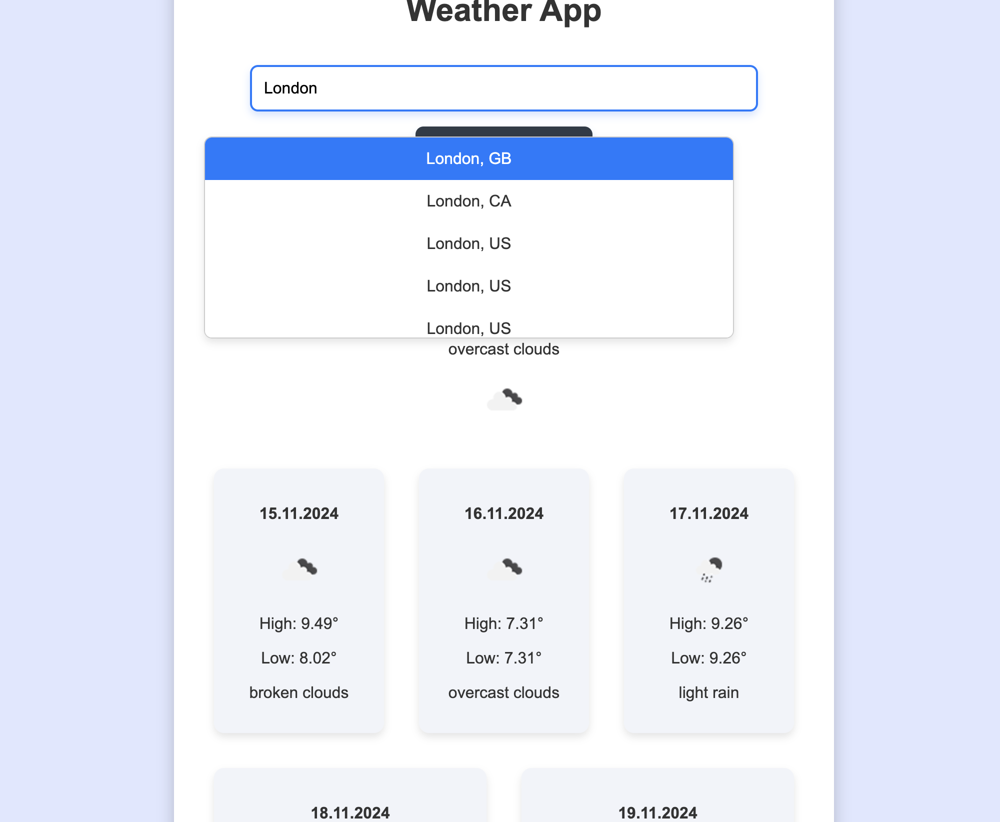
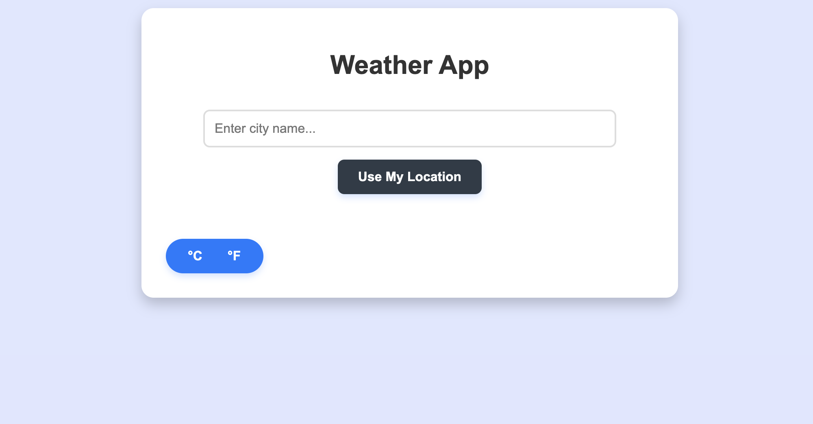
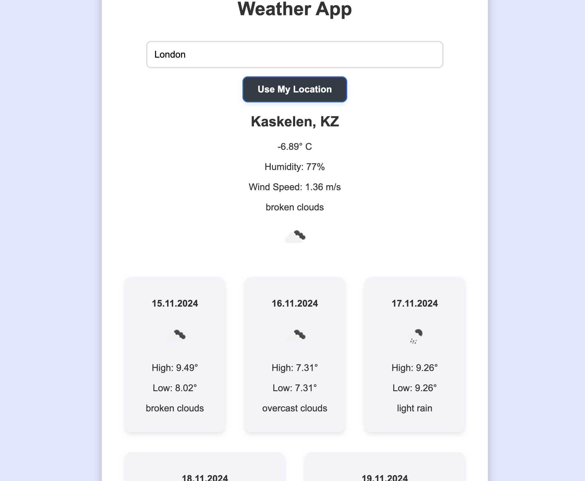

Recipe Finder
How It Works:
Search Recipes: Enter ingredients or dish names, and the app fetches relevant recipes.
View Recipe: Click on a recipe to view its details (ingredients, instructions, nutrition).
Favorites: Click the heart icon to add/remove recipes to your favorites.
Favorites Page: View all saved recipes in the "Favorites" section.
index.html,style.css,app.js

Movies App
How It Works:
Search for Movies: Enter a movie title in the search bar to get a list of matching results.
Sort and Filter: Sort movies by popularity, release date, or rating, or filter by genre (Drama, Comedy, Action, etc.).
Movie Details: Click on any movie to view detailed information, including cast, reviews, and trailer.
Add to Watchlist: Click "Add to Watchlist" to save a movie for later viewing. Remove movies from your watchlist as needed.

Files:
movie.html: The main structure of the app, containing header, buttons, and modal for movie details.
movie2.css: CSS file for styling the app, including layout, buttons, and responsiveness.
movie3.js: JavaScript file for API calls, dynamic content, and user interaction handling (search, sorting, watchlist functionality).

Weather app
This site is a weather application that allows you to:

Search weather by city: Enter a city name to view the current weather and 5-day forecast.
Use current location: The "Use My Location" button shows weather based on your location.
Toggle between units: You can choose between Celsius and Fahrenheit for temperature display.
View 5-day forecast: Detailed information on temperature, weather, and icons for each day.
Error modal window: An error message will appear in a modal if something goes wrong.
The interface dynamically updates using the OpenWeatherMap API.

Files
index.html: The main HTML file for the weather app.
weather2.css: The CSS file for styling the app. Includes styles for the layout, responsiveness, buttons, and modal.
weather3.js: The JavaScript file that handles API calls, user interactions, and updating the DOM with weather data.
